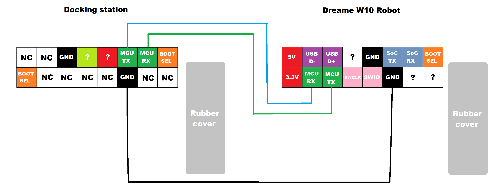
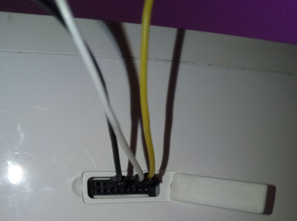
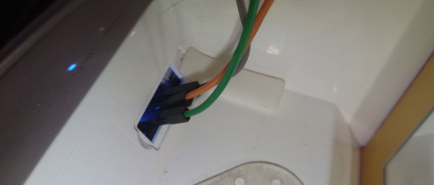
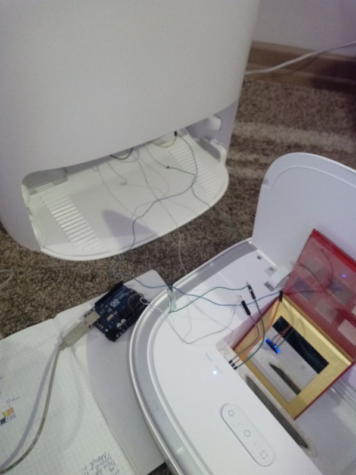
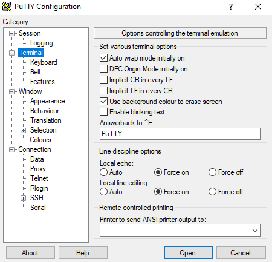
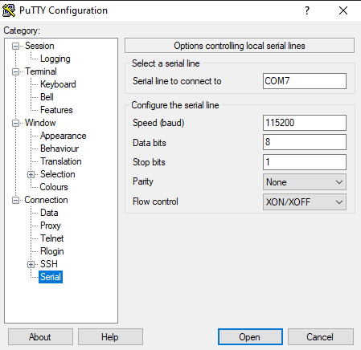
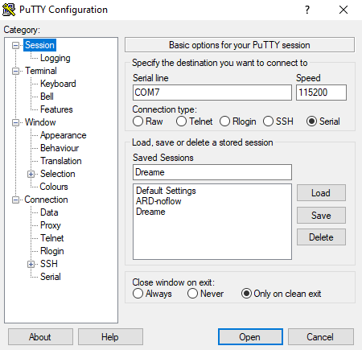

# Dock paring

Sometimes you may end up with unmatched base and robot pair. That causes the dock to not work besides charging and displaying dreame logo indefinetly. 
If you end up in that situation this guide is for you.

## Required tools (For Direct method)

- Three cables (minimum 25cm long) with breadboard connectors on the ends.

## Optional tools (for UART method)

- A 3.3V USB to TTL Serial UART Adapter (like CP2102 or Pl2303 or some Arduino models)
- [Putty](https://www.putty.org/) (or other tool for UART communication)
- The [Dreame Breakout PCB](https://github.com/Hypfer/valetudo-dreameadapter) (for easier access to RX/TX pins)
- Basic knowledge about UART communication

## High-level overview

This pairing method works by putting the dock in pairing mode that sends the pairing signal to the robot and the robot responds with correct data to the dock.

Threre are two methods that you can use:

1. [Direct method](#direct-method) - Connecting the dock and the robot debug connectors directly (Recommended!)
2. [Indirect method](#indirect-method) - Connecting the dock to the UART adapter, intercepting paring signal, sending this paring signal to the robot MCU UART interface, capturing it and sending back to the dock.

## Direct method

### Connection schematic

This schematic shows how everything should be connected   

### Connecting everything together

1. Unplug the power from the base station and turn off the robot.
2. Find the dock debug connector located on the top of the washing tray and uncover it.
3. Connect your cables to __the MCU__ RX, TX and GND pins from the dock debug connector using [the dock pinout from above](#connection-schematic)   
4. Find the robot debug connector located inside dustbin tray and uncover it.
5. Connect the other end of your cables to the robot debug connector using [the robot pinout from above](#connection-schematic) (I used a small mirror to help with putting the pins in the right holes). __IMPORTANT: Connect to the MCU pins! RX pin of the base to TX of the robot and TX pin of the base to RX of the robot! GND to GND__   
6. After that it should look something like this   

### Paring procedure

1. Power on the robot first, wait a minute for it to boot then plug the power to the base.
2. When the base is displaying "dreame" logo press and hold the right (start cleaning) button and while holding tap left (Home) button __exactly 2 times__. The base should beep a few times, if you hear only one beep then you connected the cables wrong.
3. Unplug and plug the base and reboot the robot. They should be paired now!

## Indirect method

_I don't recommend this method as I failed to send the messages properly myself_

### Putty setup

You need to change the Putty settings in order to properly pair the robot

1. Go to the "Terminal" category on the left side of the program and find "Local echo" and "Line editing".
2. Set "Local echo" to "Force on".
3. Set "Local line editing" to "Force on"   
4. Go to the "Connection -> Serial" category on the left side and ensure that "Configure the serial line settings" are as in the image below   

### Dock setup

1. Connect __the MCU__ RX, TX and GND pins from the dock debug connector to your UART adapter using the pinout from above [Pinouts](#connection-schematic)
2. Connect UART adapter to your PC and open Putty
3. Select Connection type to Serial and set correct COM port of your adapter (you can find it in device manager). Set baud rate to 115200 and click Open.   
4. Now plug the power to the dock and look at the output in terminal window. It should show something like `GitVer:accee71dC MajorVer:V3 SubVer:V4 FileSystemVer:V8 Build@Oct 28 2021-18:08:28`.
5. If you saw the first message you need to put the dock in the paring mode. To do this press and hold the right (start cleaning) button and while holding it tap left (Home) button __exactly 2 times__. - the dock should beep once - then stop holding buttons.
6. You now should see something like `<SA_><Ccc>` on the Putty output. Copy this code and save it on your PC. We will need it for the second part.
7. Unplug the UART adapter from the dock and close Putty, __but do not unplug power from the base__

### Robot setup

1. Connect __the MCU__ RX, TX and GND pins from the robot debug connector to your UART adapter using the pinout from above [Pinouts](#connecting-everything-together) 
2. Connect UART adapter to your PC and open Putty
3. Select Connection type to Serial and set correct COM port of your adapter (you can find it in device manager). Set baud rate to 115200 and click Open.   
4. Now power on the robot and look at the output in terminal window. It should show something like `Software start--`
5. If you saw the boot message you need to send the paring code you saved before to the robot. To do this: 
    1. Copy the code to clipboard
    2. Paste the code into putty
    3. Press Enter
6. If everything went right you should see response from the robot that looks something like this `<ZA☺><Rc$⸮⸮#⸮>`. This second part in fact is a MAC address of the robot Wi-Fi card but encoded using HEX so Putty might not render it properly.
7. Copy this code and save it on your PC.
8. Unplug the UART adapter from the robot and close Putty

### Dock part 2

1. Repeat steps 1-3 from the [Dock setup](#dock-setup)
2. Now paste the code from the robot into Putty window and press Enter.
3. The dock should beep a few times and should be now paired.
4. Reboot the robot and the dock to see effects.

## Thanks

Thanks to [Hypfer](https://github.com/Hypfer) and [alufers](https://github.com/alufers) for incredible help with this manual. 
Also for [Dennis](https://github.com/dgiese) for DEFCON talks that helped with understanding the architecture.

## Sources

- [https://valetudo.cloud/pages/installation/dreame.html](https://valetudo.cloud/pages/installation/dreame.html)
- [https://github.com/alufers/dreame_mcu_protocol/blob/master/dreame_z10_notes.md](https://github.com/alufers/dreame_mcu_protocol/blob/master/dreame_z10_notes.md)
- [Telegram conversation](TelegramNotes.md)
